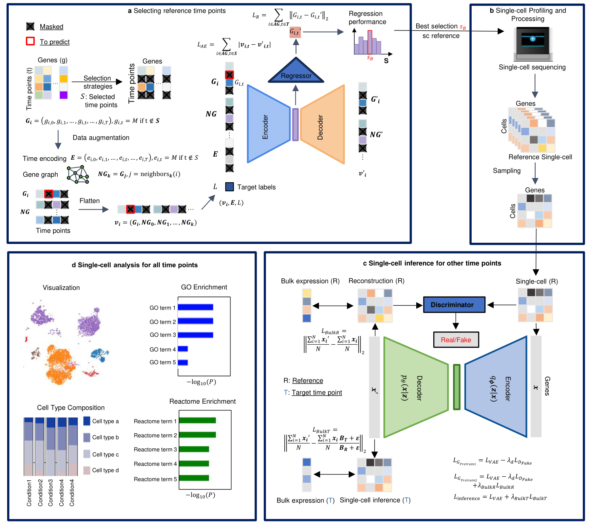

# Deep Time Point Selector and Profiler (DTPSP)
DTPSP is a machine learning model for selecting optimal time points in single-cell analysis. The goal is to maximize the information learned from single-cell experiments by predicting the most informative time points for data collection. The model uses features derived from gene expression data to inform decision-making.

*Fig. 1: DTPSP method overview*

## Overview
**a, Reference time point selection:** A subset of time points, S, is selected from temporal bulk gene expression data spanning T time points and sent to a deep learning model to predict gene expression at non-selected time points. Gene expression data from S are augmented with neighboring genes (NG) with similar expression patterns, time embeddings (E), and a target label (L) that specifies the time point to be predicted. The deep regressor model undergoes pretraining with an autoencoder-based reconstruction task before being fine-tuned for regression to predict gene expression. The subset achieving the best prediction performance, SB, is identified as the most informative set of time points for subsequent analyses. **b, Single-cell profiling and processing:** The selected optimal time points, SB, are subjected to single-cell sequencing experiments to obtain real single-cell data. Standard single-cell processing pipelines are then applied to these data. **c, Single-cell inference for unselected time points (temporal single-cell semiprofiling):** For non-selected time points, a VAE-GAN model is employed to infer single-cell data matrices. The VAE-GAN is first trained on a reconstruction task to learn the data distribution of the selected time points with real single-cell data. Subsequently, bulk gene expression data are incorporated into the model to transition the process from reconstruction to inference, generating single-cell data for the target time points. This results in a semi-profiled single-cell temporal trajectory where single-cell data are available for all time points. **d, Single-cell analysis across all time points:** The semi-profiled single-cell temporal trajectory enables comprehensive single-cell analyses, including visualization, deconvolution, enrichment analysis, and more.

## Publication
Our research manuscript detailing DTPSP is now available on bioRxiv: [DTPSP: A Deep Learning Framework for Optimized Time Point Selection in Time-Series Single-Cell Studies](https://www.biorxiv.org/content/10.1101/2024.12.18.629276v1)

## Key Contributions and Impact
#### Efficient Time-Point Selection
DTPSP identifies the most informative time points in time-series studies. By prioritizing key time points, DTPSP enables efficient allocation of resources to in-depth profiling methods like multi-omics and single-cell studies, reducing redundancy.

#### Enhanced Study of Dynamic Systems
The model supports the exploration of dynamic biological systems, such as development, disease progression, and responses to treatments, ensuring that vital temporal dynamics are captured.

#### Scalable and Versatile
DTPSP provides a scalable framework adaptable to various experimental designs, significantly improving efficiency in systems biology research.

## Tech Features
- **Simplified Workflow:** Trains on public datasets to ensure accessibility and reproducibility.
- **Single-Cell Application:** Input format is single-cell RNA-seq data.
- **Prediction Accuracy:** Employs a hybrid neural network model (autoencoder and regressor).
- **Visualization:** Ability to visualize average MAE and R2 values for all shown time points, as well as UMAP single-cell visualizations.
- **Example Tutorial:** An example notebook covering all steps, from model training and time point selection to single-cell visualization.

## Data Preparation
### Input Requirements
- Format: Data should be in AnnData's .h5ad format
- Gene Expression Matrices:
  - Genes as variables (adata.var_names)
  - Cells as observations (adata.obs_names)
### Example Data
The `example_data` folder provides data that can be used in the `Example_Code.ipynb` notebook to train a model, output average MAE and R2 values, and visualize single-cell reconstruction.
Preprocessing steps include:
- Normalizing
- Thresholding
- Normalizing (again)
- Avergaing across cells
- Log1p transformation

## Example Use
To run the example code, please follow these steps:

1. **Download the Required Files**:  
   - Download the `Example_Code.ipynb` file and the `example_data` folder.

2. **Set Up the Environment**:  
   - Ensure that Python and all required dependencies are installed. The necessary packages can be installed directly from within the notebook if not already available.

3. **Execute the Code**:  
   - Place the `example_data` folder in the same directory as the notebook.  
   - Open `Example_Code.ipynb` using Jupyter Notebook, Jupyter Lab, or Google Colab.  
   - Run the cells in the notebook sequentially to train the model and generate the outputs.

4. **Outputs**:  
   - The notebook will produce the trained model as well as average MAE and R2 values.

These steps ensure reproducibility of the findings described in this work.

## API Documentation
An exntensive API for DTPSP is under development.

## License
This project is licensed under the GNU General Public License. See the `LICENSE` file for more details.

**Happy Profiling!**
